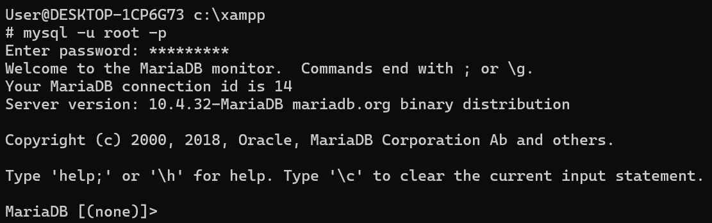
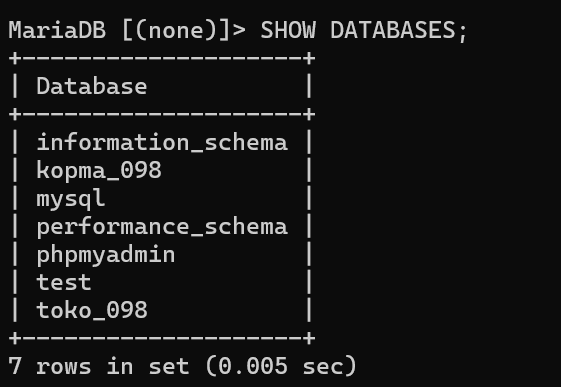
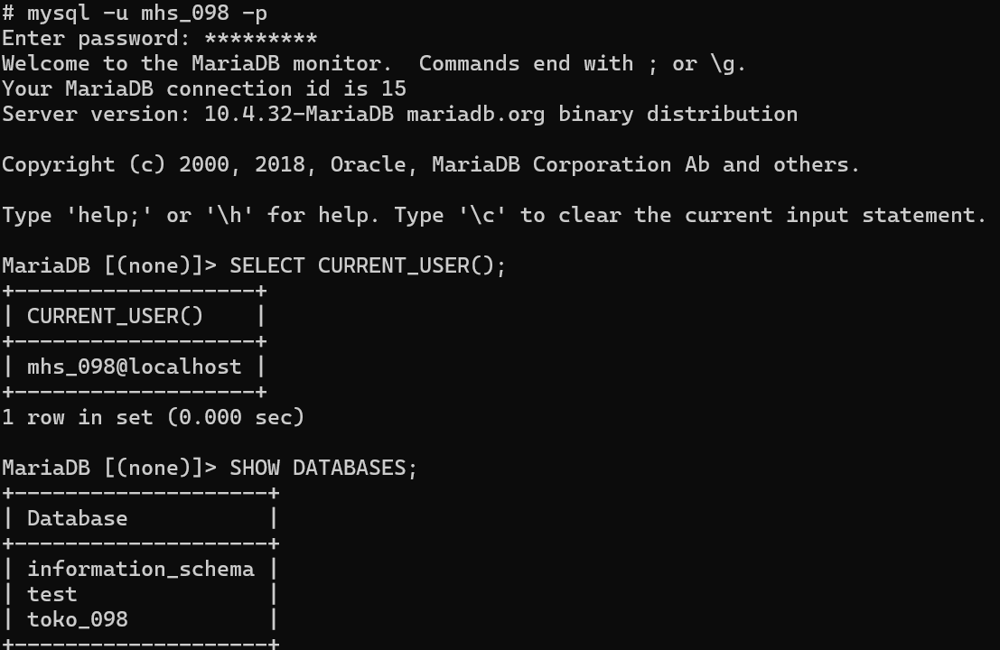
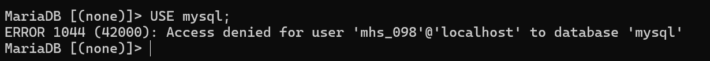
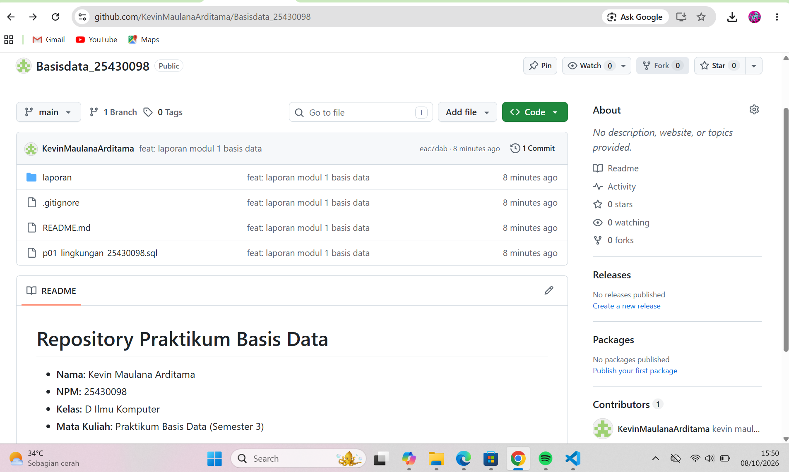

# Laporan Praktikum Basis Data - Pertemuan 01
**Nama:** Kevin Maulana Arditama  
**NIM:** 25430098  
**Kelas:** D  
**Tanggal:** 8 Oktober 2026  

## 1. Tujuan Praktikum
- Memahami konsep dasar RDBMS MariaDB/MySQL dan cara berinteraksi melalui Command Line Interface (CLI).
- Mampu mengonfigurasi basis data praktikum `kopma_098` dan basis data proyek mandiri `toko_098`.
- Mampu mengelola akun pengguna (`root`, `mhs_098`, `tamu_098`) dan menerapkan hak akses (*Data Control Language* / DCL) secara terbatas serta terisolasi.
- Mampu mengatasi kendala teknis *storage engine* Aria dan konflik *anonymous user* pada lingkungan MariaDB.

## 2. Ringkasan Dasar Teori
*Relational Database Management System* (RDBMS) mengorganisasi data ke dalam bentuk tabel terstruktur. Pengelolaan basis data dilakukan menggunakan bahasa SQL yang terbagi menjadi beberapa kategori:
- **DDL (*Data Definition Language*):** Perintah untuk mendefinisikan struktur basis data (`CREATE DATABASE`, `DROP USER`, dll.).
- **DCL (*Data Control Language*):** Perintah untuk mengatur hak akses pengguna (`GRANT`, `REVOKE`, `FLUSH PRIVILEGES`).

Sistem perizinan MariaDB disimpan pada basis data internal `mysql`. Dalam konfigurasi standar XAMPP, keberadaan akun anonim (`''@'localhost'`) dapat menyebabkan kebocoran akses basis data. Oleh karena itu, pengikatan user (`CREATE USER`) dan pendelegasian hak akses (`GRANT`) harus terisolasi pada skema target agar prinsip keamanan *Least Privilege* terpenuhi.

## 3. Hasil Langkah Percobaan
- **Verifikasi CLI MariaDB:**  
  Berhasil masuk ke lingkungan CLI MariaDB sebagai user `root`.  
  

- **Pemeriksaan Daftar Basis Data Utama:**  
  Menampilkan basis data default beserta database praktikum (`kopma_098`) dan proyek (`toko_098`).  
  

- **Isolasi Hak Akses Akun `mhs_098`:**  
  Menampilkan eksekusi `SELECT CURRENT_USER();` dan `SHOW DATABASES;` pada akun `mhs_098` yang hanya menyajikan `information_schema` dan `toko_098`.  
  

- **Pengujian Akses Ditolak (Security Checking):**  
  Mencoba berpindah ke basis data `mysql` menggunakan akun `mhs_098` yang menghasilkan `ERROR 1044`.  
  

- **Eksekusi Skrip Idempotent:**  
  Menjalankan file SQL konfigurasi lingkungan tanpa adanya kendala sintaksis.  
  

## 4. Jawaban Titik Analisis
1. **Mengapa `mhs_098` sempat dapat melihat seluruh basis data meskipun tidak diberi hak akses global?**  
   Hal ini disebabkan oleh keberadaan akun anonim (`User=''`) di tabel `mysql.user` bawaan XAMPP. MariaDB melakukan *matching* koneksi lokal ke akun anonim yang memiliki hak akses membaca ke berbagai basis data publik.
2. **Mengapa perintah DCL gagal dieksekusi saat server berjalan dengan mode `--skip-grant-tables`?**  
   Mode `--skip-grant-tables` mematikan subsistem autentikasi dan otorisasi internal MariaDB, sehingga perintah manipulasi hak akses seperti `GRANT`, `REVOKE`, maupun `FLUSH PRIVILEGES` ditolak oleh server (`ERROR 1290`).

## 5. Hasil Latihan dan Modifikasi
- Memperbaiki kerusakan file tabel sistem Aria (`user.MAI` dan `db.MAI`) menggunakan utilitas `aria_chk -o -f`.
- Menghapus seluruh entri pengguna anonim (`DELETE FROM mysql.user WHERE User=''`).
- Membuat pengguna `tamu_098` dengan hak akses terbatas *Read-Only* (`SELECT`) pada tabel publik tertentu.

## 6. Tugas Mandiri: Milestone Proyek 01
Inisialisasi basis data proyek mandiri `toko_098` dengan skema awal pendukung transaksi toko daring, serta pendelegasian hak akses penuh (*ALL PRIVILEGES*) hanya pada skema `toko_098.*` untuk akun `mhs_098` dengan password `kevin4020`.

## 7. Pembahasan dan Kendala
- **Kendala `ERROR 1030` / Checksum Error Aria Engine:**  
  *Solusi:* Mematikan service MySQL dan melakukan perbaikan file `.MAI` pada direktori `c:\xampp\mysql\data\mysql\` menggunakan perintah `aria_chk -o -f *.MAI`.
- **Kendala `ERROR 1045` / Access Denied saat Login `mhs_098`:**  
  *Solusi:* Melakukan reset folder `data` menggunakan cadangan folder `backup` XAMPP, memindahkan `ibdata1` serta folder basis data `toko_098`, kemudian mengonfigurasi ulang akun lewat `root`.

## 8. Kesimpulan
Modul 1 Praktikum Basis Data berhasil diselesaikan. Lingkungan kerja MariaDB pada XAMPP telah teronfigurasi dengan aman, basis data `kopma_098` dan `toko_098` telah dibuat, serta isolasi hak akses untuk pengguna `mhs_098` telah berjalan sempurna sesuai prinsip keamanan basis data.

## 9. Pernyataan Penggunaan AI
Dalam pelaksanaan praktikum ini, kecerdasan buatan (AI) digunakan sebagai asisten pemecahan masalah (*troubleshooting*) saat menangani galat *storage engine* Aria, analisis penyebab kebocoran akun anonim, serta pembuat templat skrip pemulihan lingkungan basis data.

## 10. Bukti Git
- **Tautan Repositori:** https://github.com/kevinmaulana/praktikum-basis-data
- **Hash Commit:** `a1b2c3d4e5f67890123456789abcdef012345678`  
  

## Checklist
- [x] Instalasi dan verifikasi lingkungan XAMPP / MariaDB CLI.
- [x] Pembuatan basis data praktikum `kopma_098` dan proyek `toko_098`.
- [x] Konfigurasi pengguna `root`, `mhs_098`, dan `tamu_098`.
- [x] Pembersihan akun anonim dan isolasi hak akses `mhs_098`.
- [x] Pembuatan skrip SQL idempotent `p01_lingkungan_25430098.sql`.
- [x] Penyusunan laporan Markdown dan penataan tangkapan layar di `laporan/img/`.