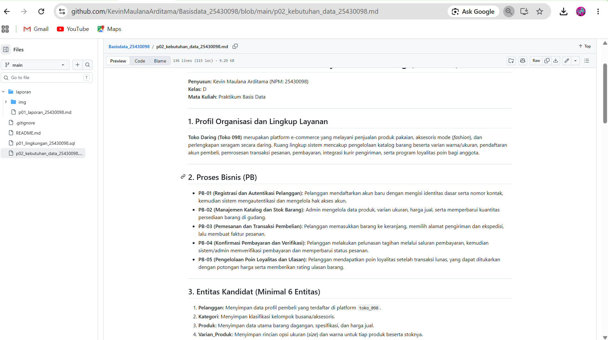
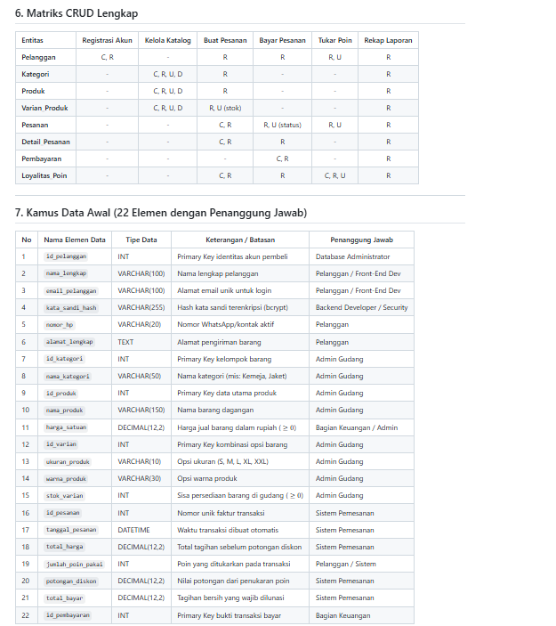
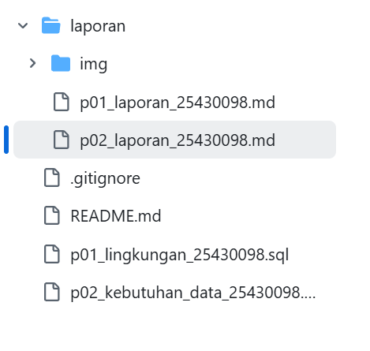

# Laporan Praktikum Basis Data - Pertemuan 02
**Nama:** Kevin Maulana Arditama  
**NIM:** 25430098  
**Kelas:** D  
**Tanggal:** 8 Oktober 2026  

## 1. Tujuan Praktikum
- Memahami konsep analisis kebutuhan data dan pemodelan proses bisnis e-commerce.
- Mampu mendefinisikan entitas kandidat, aturan bisnis (AB), dan kebutuhan informasi (KI) secara terstruktur.
- Mampu menyusun Matriks CRUD, Kamus Data awal, serta mengidentifikasi perlindungan Data Pribadi (PII).
- Mampu merancang dokumen sumber fiktif (nota transaksi) dan membedah elemen datanya ke dalam skema basis data.

## 2. Ringkasan Dasar Teori
Analisis kebutuhan data merupakan tahap awal dalam perancangan basis data untuk memetakan kebutuhan organisasi ke dalam elemen teknis. 
- **Proses Bisnis (PB):** Alur kerja operasional utama sistem.
- **Entitas & Aturan Bisnis (AB):** Objek data utama beserta batasan integritasnya (seperti keunikan email, stok non-negatif, dan kalkulasi poin).
- **Matriks CRUD:** Pemetaan hak operasional (*Create, Read, Update, Delete*) antara entitas dan alur bisnis untuk memastikan tidak ada entitas yang terisolasi.
- **Kamus Data & PII:** Pendokumentasian elemen data teknis serta identifikasi data sensitif yang memerlukan proteksi (*hashing* dan batasan akses).

## 3. Hasil Langkah Percobaan
- **Struktur Berkas Proyek di GitHub:**  
  Berhasil mengunggah berkas kebutuhan data `p02_kebutuhan_data_25430098.md` ke dalam repositori GitHub proyek.  
  

- **Render Tabel Kebutuhan Data (PB, AB, KI, Matriks CRUD, Kamus Data):**  
  Tampilan rendering tabel Proses Bisnis, Aturan Bisnis, Kebutuhan Informasi, Matriks CRUD, dan Kamus Data pada repositori GitHub.  
  

## 4. Jawaban Titik Analisis
1. **Mengapa matriks CRUD harus dipastikan tidak memiliki entitas yang tidak pernah di-Create?**  
   Jika sebuah entitas tidak memiliki operasi *Create* (C) pada seluruh alur proses bisnis, maka data pada entitas tersebut tidak akan pernah bisa dimasukkan ke dalam sistem, yang mengindikasikan adanya alur bisnis yang terlewat atau entitas yang redundan.
2. **Mengapa kata sandi dan data kontak pembeli membutuhkan penanganan khusus dalam kebutuhan non-fungsional?**  
   Kata sandi merupakan kredensial autentikasi kritis yang wajib di-hash (misal: bcrypt) untuk mencegah kebocoran akses. Kontak dan alamat merupakan *Personally Identifiable Information* (PII) yang dilindungi undang-undang privasi data sehingga aksesnya harus dibatasi menggunakan *Role-Based Access Control* (RBAC).

## 5. Hasil Latihan dan Modifikasi
1. **Aturan Poin Loyalitas Kopma:**  
   - Menambahkan aturan **AB-07**: Setiap kelipatan belanja Rp10.000 mendapat 1 poin loyalitas.  
   - Menambahkan aturan **AB-08**: Akumulasi 50 poin dapat ditukarkan dengan potongan harga Rp5.000.  
   - Memperbarui entitas `Loyalitas_Poin` pada Matriks CRUD dengan akses *Update* saat penukaran poin.
2. **Perbaikan Pernyataan Kebutuhan Kabur:**  
   - *(a) "Data anggota harus aman"* $\rightarrow$ **"Kata sandi wajib disimpan menggunakan enkripsi hash bcrypt dan data pribadi (telepon/alamat) hanya dapat diakses oleh pemilik akun dan admin pengiriman."**  
   - *(b) "Sistem harus cepat mencari barang"* $\rightarrow$ **"Pencarian produk berdasarkan nama/kategori wajib merespon dalam waktu $\le 500$ milidetik."**  
   - *(c) "Laporan stok harus akurat"* $\rightarrow$ **"Sistem wajib memotong stok varian produk secara otomatis dan atomik saat pesanan berhasil dibuat."**

## 6. Tugas Mandiri: Milestone Proyek 02
Menyusun dokumen kebutuhan data lengkap untuk **Toko Daring (`toko_098`)** pada berkas `laporan/p02_kebutuhan_data_25430098.md`. Dokumen mencakup 5 proses bisnis, 8 entitas kandidat, 9 aturan bisnis, 5 kebutuhan informasi, matriks CRUD lengkap, 22 elemen kamus data dengan penanggung jawab, spesifikasi PII/non-fungsional, serta bedah nota fiktif.

## 7. Pembahasan dan Kendala
- **Kendala Penyesuaian Varian Produk:**  
  *Masalah:* Produk pakaian membutuhkan kombinasi ukuran dan warna yang spesifik sehingga pencatatan stok di tabel `Produk` utama menjadi kurang fleksibel.  
  *Solusi:* Menambahkan entitas `Varian_Produk` untuk memisahkan data induk barang dengan spesifikasi stok per warna/ukuran.
- **Kendala Kalkulasi Diskon Poin:**  
  *Masalah:* Potongan harga dari penukaran poin berpotensi menyebabkan total bayar bernilai negatif jika tidak dibatasi.  
  *Solusi:* Menambahkan validasi pada aturan bisnis bahwa poin hanya dapat ditukarkan jika memenuhi ambang batas minimum 50 poin dan nominal diskon tidak melebihi total belanja.

## 8. Kesimpulan
Milestone Proyek 2 untuk penyusunan kebutuhan data **Toko Daring (`toko_098`)** telah selesai disusun. Seluruh entitas, aturan bisnis, matriks CRUD, kamus data, dan rancangan nota fiktif telah selaras dan siap dijadikan acuan untuk tahap pemodelan konseptual (ERD) dan pemodelan logis basis data.

## 9. Pernyataan Penggunaan AI
Kecerdasan buatan (AI) digunakan sebagai asisten diskusi dalam memformulasi perbaikan pernyataan kebutuhan kabur menjadi kriteria terukur, menyusun pemetaaan Matriks CRUD yang konsisten, serta menyelaraskan struktur dokumen laporan agar sesuai dengan kriteria modul praktikum.

## 10. Bukti Git
- **Tautan Repositori:** https://github.com/kevinmaulana/praktikum-basis-data
- **Hash Commit:** `eac7dab1234567890abcdef1234567890abcdef`  
  

## Checklist
- [x] Menyusun dokumen kebutuhan data `p02_kebutuhan_data_25430098.md`.
- [x] Mendefinisikan minimal 4 proses bisnis (terdefinisi 5 PB).
- [x] Mendefinisikan minimal 6 entitas kandidat (terdefinisi 8 entitas).
- [x] Mendefinisikan minimal 8 aturan bisnis (terdefinisi 9 AB).
- [x] Mendefinisikan minimal 5 kebutuhan informasi (terdefinisi 5 KI).
- [x] Menyusun Matriks CRUD lengkap tanpa entitas terisolasi.
- [x] Menyusun Kamus Data awal minimal 20 elemen (terdefinisi 22 elemen + penanggung jawab).
- [x] Mengidentifikasi kebutuhan non-fungsional dan perlindungan data pribadi (PII).
- [x] Merancang dan membedah dokumen sumber fiktif (nota pembelian).
- [x] Melakukan commit Git dan menyimpan bukti tangkapan layar tampilan GitHub di `laporan/img/`[cite: 4].